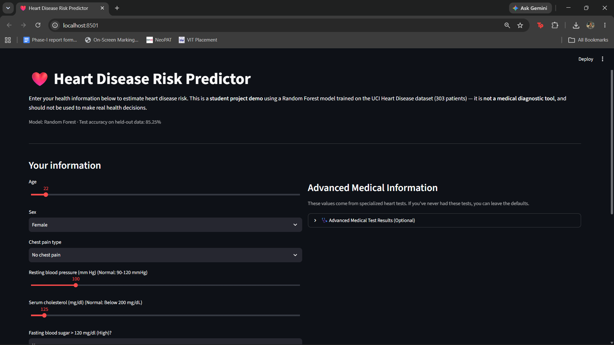
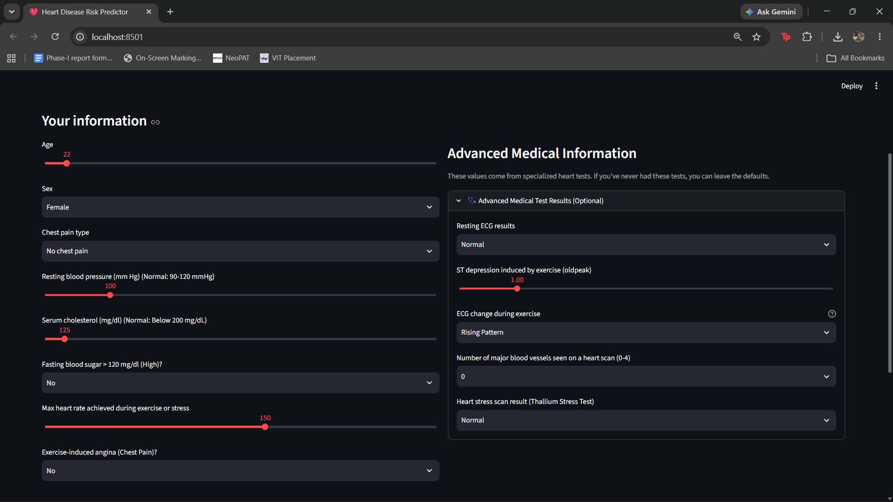
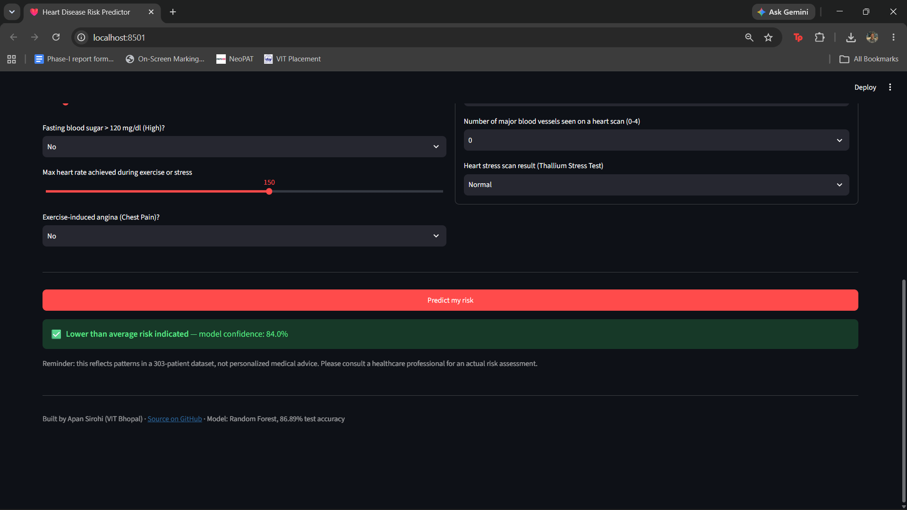

# ❤️ Heart Disease Risk Predictor

A machine learning project comparing seven supervised classification algorithms for predicting heart disease risk using the UCI Heart Disease Dataset. The best-performing model (Random Forest) is deployed through an interactive Streamlit web application designed for non-technical users.

> **Disclaimer**
> This project is intended for educational purposes only and is **not** a medical diagnostic tool.

---

# Overview

Heart disease is one of the leading causes of mortality worldwide, and early detection can significantly improve outcomes. This project applies and compares several supervised machine learning algorithms on the **UCI Heart Disease Dataset (Cleveland)** to predict whether a patient is at risk.

The project also includes an interactive Streamlit application where users can enter their health information and receive a real-time prediction along with the model's confidence score.

---

# ✨ Features

- 📊 Comparison of **7 Machine Learning classification algorithms**
- 🌲 Random Forest selected as the best-performing model
- ❤️ Interactive Streamlit web application
- 💡 Beginner-friendly interface with simplified medical terminology
- 🩺 Advanced medical parameters grouped separately to reduce UI complexity
- 📈 Real-time prediction with model confidence
- ⚠️ Educational disclaimer for responsible use

---

# Models Compared

- Logistic Regression
- Naive Bayes
- Support Vector Machine (Linear Kernel)
- K-Nearest Neighbors
- Decision Tree
- **Random Forest** ⭐
- XGBoost

---

# Dataset

- **Source:** UCI Heart Disease Dataset (Cleveland)
- **Records:** 303 patients
- **Train/Test Split:** 80% / 20%
- **Features:** 13 input features + target label

The dataset contains:

- Age
- Sex
- Chest Pain Type
- Resting Blood Pressure
- Cholesterol
- Fasting Blood Sugar
- Resting ECG Results
- Maximum Heart Rate Achieved
- Exercise-induced Angina
- ST Depression (Oldpeak)
- Slope of ST Segment
- Number of Major Blood Vessels
- Thallium Stress Test Result

Place `heart.csv` in the project directory before running the notebook or Streamlit application.

---

# Results

| Model | Accuracy | Precision | Recall | F1 Score |
|---------------------|---------:|----------:|-------:|---------:|
| Logistic Regression | 85.25 | 88.24 | 85.71 | 86.96 |
| Naive Bayes | 85.25 | 91.18 | 83.78 | 87.32 |
| SVM (Linear) | 81.97 | 88.24 | 81.08 | 84.51 |
| KNN | 67.21 | 67.65 | 71.88 | 69.70 |
| Decision Tree | 81.97 | 82.35 | 84.85 | 83.58 |
| **Random Forest** | **86.89** | **88.24** | **88.24** | **88.24** |
| XGBoost | 83.61 | 85.29 | 85.29 | 85.29 |

Among all evaluated models, **Random Forest** achieved the highest overall performance and was selected for deployment in the Streamlit application.

---

# 🌐 Live Demo

The Streamlit application allows users to:

- Enter common health information
- Predict heart disease risk instantly
- View model confidence
- Optionally provide advanced cardiac test results
- Receive predictions through a clean and beginner-friendly interface

**🔗 Live Demo:** 
https://heartdiseaseriskpredictor-vzop5baqynkdefpwh2uwx8.streamlit.app/


---

# 📸 Screenshots

## Home Page



Users can enter commonly known health information such as age, blood pressure, cholesterol levels, exercise history, and other lifestyle-related parameters.

---

## Advanced Medical Information



Advanced cardiac test results are grouped inside a collapsible section to keep the interface simple while still supporting users who have undergone specialized medical testing.

---

## Prediction Result



The application predicts whether the entered health profile indicates a higher or lower-than-average heart disease risk and displays the model's confidence together with an educational disclaimer.

---

# 📁 Repository Structure

```text
├── app.py
├── source_code_group_7_fixed.ipynb
├── Heart_Disease_Prediction_using_ML_Project_report.pdf
├── heart.csv
├── requirements.txt
└── README.md
```

---

# 🚀 Setup

Install the required dependencies:

```bash
pip install -r requirements.txt
```

Run the notebook:

```bash
jupyter notebook source_code_group_7_fixed.ipynb
```

---

# ▶️ Running the Streamlit App

```bash
streamlit run app.py
```

The application will launch at:

```
http://localhost:8501
```

Ensure `heart.csv` is located in the project directory.

---

# ☁️ Deploying with Streamlit Cloud

1. Push this repository to GitHub.
2. Visit https://share.streamlit.io
3. Create a new app.
4. Select this repository.
5. Choose `app.py` as the entry point.
6. Click **Deploy**.


---

# 🛠 Tech Stack

- Python
- Pandas
- NumPy
- Scikit-learn
- XGBoost
- Streamlit
- Matplotlib
- Seaborn
- Jupyter Notebook

---

# Limitations

- Trained on a relatively small dataset (303 patient records)
- Performance may not generalize to different populations
- Intended for educational purposes only
- Not a substitute for professional medical diagnosis

---

# 👨‍💻 Created by

**Apan Sirohi**
**School of Computer Science and Engineering**  
**VIT Bhopal University — Dec 2024**

---

# 📚 References

- UCI Heart Disease Dataset  
  https://archive.ics.uci.edu/dataset/45/heart+disease
